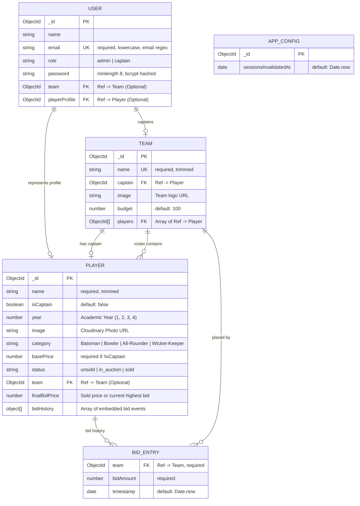

# 🗄️ DGPL Auction - Database Architecture & Schema Documentation

This document provides a comprehensive, complete overview of the database design, schemas, relationships, constraints, indexes, and real-time state lifecycle used in the **DGPL Auction** platform.

---

## 📑 Table of Contents
1. [Architecture Overview](#-architecture-overview)
2. [Entity Relationship Diagram (ERD)](#-entity-relationship-diagram-erd)
3. [Collections & Schema Reference](#-collections--schema-reference)
   - [Users Collection](#1-users-collection)
   - [Players Collection](#2-players-collection)
   - [Teams Collection](#3-teams-collection)
   - [AppConfig Collection](#4-appconfig-collection)
4. [Cross-Entity Relationships](#-cross-entity-relationships)
5. [Business Logic & Database Operations](#-business-logic--database-operations)
   - [Tiered Bid Calculation](#1-tiered-bid-calculation-rules)
   - [Atomic Bidding & Race Condition Prevention](#2-atomic-bidding--race-condition-prevention)
   - [Player Sale Transaction & Budget Deduction](#3-player-sale-transaction--budget-deduction)
6. [Initial Seeding & Sample Data](#-initial-seeding--sample-data)
7. [PostgreSQL Migration Mapping Guide](#-postgresql-migration-mapping-guide)

---

## 🏛️ Architecture Overview

The database layer is designed to handle high-concurrency real-time bidding events with low latency while maintaining strict referential and transactional consistency during player sales.

* **Primary Engine**: MongoDB / Document Store (Mongoose ODM)
* **Real-time Sync**: Socket.IO integrated with MongoDB atomic updates
* **Local Development Engine**: In-memory MongoDB ReplicaSet (`mongodb-memory-server`) for zero-setup execution and automatic data seeding.

---

## 📊 Entity Relationship Diagram (ERD)



---

## 📚 Collections & Schema Reference

### 1. `users` Collection
**File**: [`backend/models/userModel.js`](file:///e:/gulteez_auction/DGPL-Auction/backend/models/userModel.js)  
Stores user credentials, access control roles, and relations to teams and player profiles.

| Field Name | Type | Validation / Constraints | Default | Description |
| :--- | :--- | :--- | :--- | :--- |
| `_id` | `ObjectId` | Auto-generated PK | Auto | Unique identifier |
| `name` | `String` | None | `undefined` | Display name |
| `email` | `String` | **Required**, Unique, Lowercase, Trim, Validated via `validator.isEmail` | - | Primary login identifier |
| `role` | `String` | Enum values: `admin`, `captain` | `undefined` | User authorization role |
| `password` | `String` | **Required**, Min length: 8, `select: false` | - | Bcrypt hashed string (12 salt rounds) |
| `team` | `ObjectId` | `ref: 'Team'` | `null` | Associated franchise for captain users |
| `playerProfile` | `ObjectId` | `ref: 'Player'` | `null` | Associated player card for captain users |

#### ⚙️ Hooks & Methods
* **`pre('save')`**: Automatically hashes modified passwords with `bcrypt.hash(password, 12)`.
* **Instance Method `checkPassword(candidatePassword, userPassword)`**: Compares plaintext password candidate against stored bcrypt hash.

---

### 2. `players` Collection
**File**: [`backend/models/playerModel.js`](file:///e:/gulteez_auction/DGPL-Auction/backend/models/playerModel.js)  
Represents tournament players, their categorization, current auction state, and bid history.

| Field Name | Type | Validation / Constraints | Default | Description |
| :--- | :--- | :--- | :--- | :--- |
| `_id` | `ObjectId` | Auto-generated PK | Auto | Unique identifier |
| `name` | `String` | **Required**, Trimmed | - | Full player name |
| `isCaptain` | `Boolean` | None | `false` | Distinguishes captains from regular players |
| `year` | `Number` | None (Values: 1, 2, 3, 4) | `undefined` | College academic year |
| `image` | `String` | URL string | `undefined` | Cloudinary profile photo URL |
| `category` | `String` | **Required**, Enum: `['Batsman', 'Bowler', 'All-Rounder', 'Wicket-Keeper']` | - | Playing role discipline |
| `basePrice` | `Number` | **Required if `!isCaptain`** | `undefined` | Base auction bidding price (e.g. 0.5) |
| `status` | `String` | Enum: `['unsold', 'in_auction', 'sold']` | `'unsold'` | Current auction status |
| `team` | `ObjectId` | `ref: 'Team'` | `null` | Assigned team when sold or captained |
| `finalBidPrice`| `Number` | None | `undefined` | Final sold price or active highest bid |
| `bidHistory` | `Array<Bid>`| Subdocument array (schema below) | `[]` | Chronological list of placed bids |

#### 📂 Embedded Subdocument: `bidHistory`
```typescript
interface BidHistoryItem {
  team: ObjectId;      // Required, ref: 'Team'
  bidAmount: number;   // Required, numeric bid value
  timestamp: Date;     // Default: Date.now
}
```

#### ⚡ Indexes
* `{ status: 1 }`: Optimized for quick filtering on unsold players and querying the single active player in auction (`status: 'in_auction'`).

---

### 3. `teams` Collection
**File**: [`backend/models/teamModel.js`](file:///e:/gulteez_auction/DGPL-Auction/backend/models/teamModel.js)  
Represents the participating tournament franchises, purse budget balances, and rosters.

| Field Name | Type | Validation / Constraints | Default | Description |
| :--- | :--- | :--- | :--- | :--- |
| `_id` | `ObjectId` | Auto-generated PK | Auto | Unique identifier |
| `name` | `String` | **Required**, Unique, Trimmed | - | Franchise team name (e.g. *"Unrivalled Knights"*) |
| `captain` | `ObjectId` | `ref: 'Player'` | `undefined` | Captain's player profile reference |
| `image` | `String` | URL string | `undefined` | Team logo / emblem |
| `budget` | `Number` | Numeric purse | `100` | Remaining purse budget points |
| `players` | `Array<ObjectId>` | Array of `ref: 'Player'` | `[]` | Roster of player IDs belonging to this team |

#### ⚙️ Hooks & Methods
* **`pre('save')`**: Ensures the assigned `captain` is always included inside the `players` array.
* **`pre('findOneAndUpdate')`**: Intercepts captain updates and uses `$addToSet` to safely append the captain to `players` without creating duplicates.
* **Index**: `{ captain: 1 }` for rapid lookup of teams by captain.

---

### 4. `appconfig` Collection
**File**: [`backend/models/appConfigModel.js`](file:///e:/gulteez_auction/DGPL-Auction/backend/models/appConfigModel.js)  
Stores global operational flags and security parameters.

| Field Name | Type | Constraints | Default | Description |
| :--- | :--- | :--- | :--- | :--- |
| `_id` | `ObjectId` | Auto PK | Auto | Configuration ID |
| `sessionsInvalidatedAt` | `Date` | None | `Date.now` | Global timestamp used to revoke and invalidate active JWT sessions |

---

## 🔗 Cross-Entity Relationships

```
┌──────────────┐         1:1 (Captain)          ┌──────────────┐
│    User      ├───────────────────────────────►│    Team      │
└──────┬───────┘                                └──────┬───────┘
       │                                               │
       │ 1:1 (Profile)                                 │ 1:N (Roster)
       ▼                                               ▼
┌──────────────┐         N:1 (Sold To)          ┌──────────────┐
│   Player     │◄───────────────────────────────┤    Player    │
└──────┬───────┘                                └──────────────┘
       │
       │ 1:N (Embeds)
       ▼
┌──────────────┐         N:1 (References)       ┌──────────────┐
│  BidHistory  ├───────────────────────────────►│    Team      │
└──────────────┘                                └──────────────┘
```

---

## ⚡ Business Logic & Database Operations

### 1. Tiered Bid Calculation Rules
Implemented in [`backend/server.js`](file:///e:/gulteez_auction/DGPL-Auction/backend/server.js#L130-L152):
* **Initial Bid**: Exactly matches `player.basePrice` (e.g. `0.5`).
* **Subsequent Bids (Tiered Increments)**:
  $$\text{Next Bid} = \begin{cases} \text{Current Bid} + 0.25 & \text{if } \text{Current Bid} < 5.00 \\ \text{Current Bid} + 0.50 & \text{if } 5.00 \le \text{Current Bid} < 10.00 \\ \text{Current Bid} + 1.00 & \text{if } \text{Current Bid} \ge 10.00 \end{cases}$$

### 2. Atomic Bidding & Race Condition Prevention
Implemented in [`backend/server.js`](file:///e:/gulteez_auction/DGPL-Auction/backend/server.js#L264-L348):
* Uses an atomic `findOneAndUpdate` with MongoDB `$expr` to ensure:
  1. The player is still in `status: 'in_auction'`.
  2. The `bidHistory` length and latest bid amount have not changed between read and write.
  3. Bids from the same team consecutively are blocked.
  4. Team budget is verified before committing.

### 3. Player Sale Transaction & Budget Deduction
Implemented in [`backend/controllers/auctionController.js`](file:///e:/gulteez_auction/DGPL-Auction/backend/controllers/auctionController.js#L77-L140):
* Uses a **MongoDB Multi-Document Session Transaction** (with non-transactional atomic fallback):
  ```js
  // 1. Mark player as sold with winning team & final price
  await Player.findByIdAndUpdate(playerId, {
    status: 'sold',
    team: teamId,
    finalBidPrice: finalBid
  }, { session });

  // 2. Atomically deduct purse budget & add to team roster
  await Team.findByIdAndUpdate(teamId, {
    $addToSet: { players: playerId },
    $inc: { budget: -finalBid }
  }, { session });
  ```

---

## 📦 Initial Seeding & Sample Data

Files located in [`backend/data/`](file:///e:/gulteez_auction/DGPL-Auction/backend/data/):
* [`users.json`](file:///e:/gulteez_auction/DGPL-Auction/backend/data/users.json): 1 Admin account, 4 Captain user accounts.
* [`teams.json`](file:///e:/gulteez_auction/DGPL-Auction/backend/data/teams.json): 4 tournament teams with default 100 budgets:
  1. *Unrivalled Knights*
  2. *X1 Musketeers*
  3. *Power House*
  4. *Intimidators*
* [`players.json`](file:///e:/gulteez_auction/DGPL-Auction/backend/data/players.json): Tournament players categorized across Years 1–4 with categories, Cloudinary image assets, and base prices.

---

## 🔄 PostgreSQL Migration Mapping Guide

| MongoDB (Current) | PostgreSQL / Relational Equivalent | Type / Constraint |
| :--- | :--- | :--- |
| `users` collection | `users` table | `id UUID/SERIAL, email VARCHAR UNIQUE, password_hash TEXT, role VARCHAR` |
| `teams` collection | `teams` table | `id UUID/SERIAL, name VARCHAR UNIQUE, budget NUMERIC(10,2) CHECK (budget >= 0)` |
| `players` collection | `players` table | `id UUID/SERIAL, name VARCHAR, category VARCHAR, base_price NUMERIC, status VARCHAR` |
| `players.bidHistory` array | **`bids` table** (Normalized) | `id UUID/SERIAL, player_id FK -> players(id), team_id FK -> teams(id), bid_amount NUMERIC, created_at TIMESTAMP` |
| `team.players` array | **`players.team_id` FK** | Direct foreign key relation `players.team_id REFERENCES teams(id)` |
| `team.budget < 0` prevention | **`CHECK (budget >= 0)`** | Native SQL Check Constraint |
